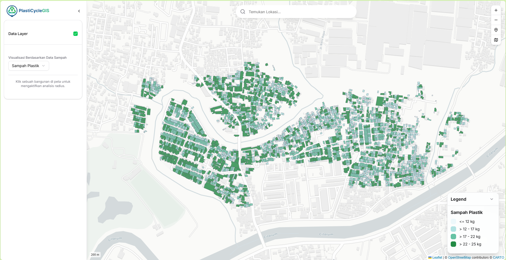
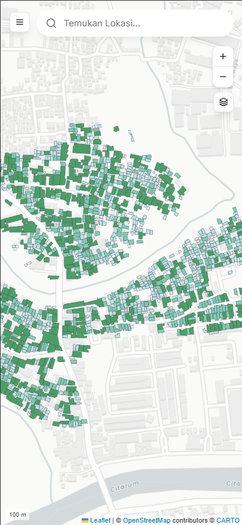

# GisSampah App - Aplikasi Pemetaan Sampah Responsif.

Sebuah platform pemetaan interaktif yang dibangun dengan Next.js dan Leaflet untuk memvisualisasikan dan menganalisis data sampah secara spasial. Aplikasi ini menyediakan antarmuka yang bersih, modern, dan sepenuhnya responsif untuk perangkat desktop maupun mobile.

LinkProject: [gis-sampah-app](https://gis-sampah-app.vercel.app/)

|                         Tampilan Desktop                         |                        Tampilan Mobile                         |
| :--------------------------------------------------------------: | :------------------------------------------------------------: |
|  |  |

---

## ✨ Fitur Utama

- **Desain Sepenuhnya Responsif**: Antarmuka yang dioptimalkan untuk memberikan pengalaman pengguna yang intuitif di perangkat desktop (dengan sidebar) dan mobile (dengan panel geser dan toolbar ringkas).
- **Peta Interaktif & Cepat**: Dibangun di atas Leaflet.js dan React-Leaflet untuk rendering peta yang mulus.
- **Visualisasi Data Tematik**: Data GeoJSON diwarnai secara dinamis berdasarkan klasifikasi _Natural Breaks (Jenks)_ untuk berbagai atribut (volume sampah, luas area, dll.), memastikan representasi data yang akurat secara statistik.
- **Analisis Spasial Radius**:
  - Secara otomatis melakukan analisis pada bangunan di sekitar titik yang diklik.
  - Visualisasi radius di peta dengan lingkaran dan highlight pada bangunan yang masuk dalam radius.
  - Menampilkan ringkasan statistik (jumlah bangunan, sebaran data) dalam bentuk chart donat di sidebar.
  - Radius dapat diubah secara interaktif menggunakan slider.
- **Manajemen State Terpusat**: Menggunakan **Zustand** untuk state management yang efisien, reaktif, dan mudah diakses di seluruh komponen.
- **Pencarian Lokasi Geografis**: Mencari alamat atau nama tempat menggunakan API Nominatim, dilengkapi saran autocomplete dan _debounce_ untuk performa optimal.
- **Kontrol Peta Adaptif**:
  - **Desktop**: Toolbar vertikal ringkas untuk Zoom, Kembali ke Posisi Awal, dan Pilihan Basemap.
  - **Mobile**: Kontrol zoom terpisah dan tombol aksi utama yang membuka `Popover` berisi sisa alat peta, menghemat ruang layar.
- **Panel Informasi Detail**: Menampilkan informasi rinci dari poligon yang diklik dalam kartu yang mengambang di tengah layar, dengan tab untuk detail dan analisis awal.
- **Styling & Tema Dinamis**:
  - Beralih dengan mulus antara tema peta **Light, Dark, dan Satellite**.
  - Border poligon secara otomatis berubah warna untuk kontras maksimal di setiap tema.
- **Indikator Skala Kustom**: Menampilkan skala peta (misal, "50 m") dalam format teks minimalis, tanpa elemen grafis yang mengganggu.

---

## 🚀 Teknologi yang Digunakan

- **Framework**: [Next.js](https://nextjs.org/) (App Router)
- **Bahasa**: [TypeScript](https://www.typescriptlang.org/)
- **Peta**: [Leaflet.js](https://leafletjs.com/) & [React-Leaflet](https://react-leaflet.js.org/)
- **Styling**: [Tailwind CSS](https://tailwindcss.com/)
- **Komponen UI**: [shadcn/ui](https://ui.shadcn.com/)
- **State Management**: [Zustand](https://github.com/pmndrs/zustand)
- **Ikon**: [Lucide React](https://lucide.dev/)
- **Geocoding API**: [Nominatim (OpenStreetMap)](https://nominatim.org/)

---

## 📁 Struktur Folder Proyek

Proyek ini menggunakan struktur direktori root untuk kejelasan, memisahkan logika aplikasi, hooks, dan state management.

```
gissampah-app/
├── app/ # Halaman dan layout utama (Next.js App Router)
├── components/
│ ├── controls/ # Kontrol peta (Toolbar, LayerControl, ZoomControl, dll.)
│ ├── layout/ # Komponen layout utama (Wrappers, Header, Sidebar)
│ ├── map/ # Komponen inti peta (MapDisplay, GeoJsonLayer, AnalysisCircle)
│ ├── panel/ # Komponen panel informasi (BuildingInfo, LegendDisplay, RadiusAnalysisPanel)
│ └── ui/ # Komponen dari shadcn/ui
├── hooks/ # Hooks kustom React (useDebounce, useBreakpoint)
├── lib/ # Fungsi utilitas (mapUtils.ts untuk klasifikasi & warna)
├── public/
│ ├── data/ # File sumber GeoJSON
│ ├── Screenshot/ # Screenshot untuk README
│ └── images/ # Gambar thumbnail untuk basemap
├── store/ # State management global (Zustand: mapStore.ts)
├── styles/ # File CSS kustom (untuk override style Leaflet)
├── types/ # Definisi tipe TypeScript global (index.ts)
└── ... # File konfigurasi (next.js, tailwind, postcss, dll.)
```

---

## 🏁 Memulai Proyek

### Prasyarat

- [Node.js](https://nodejs.org/) (versi LTS direkomendasikan)
- [npm](https://www.npmjs.com/) atau [yarn](https://yarnpkg.com/) atau [pnpm](https://pnpm.io/)

### Instalasi

1.  Clone repositori ini:
    ```bash
    git clone [URL_REPOSITORI]
    ```
2.  Masuk ke direktori proyek:
    ```bash
    cd gissampah-app
    ```
3.  Instal semua dependensi:
    ```bash
    npm install
    # atau
    yarn install
    ```

### Menjalankan Server Pengembangan

Setelah instalasi selesai, jalankan server pengembangan:

```bash
npm run dev
# atau
yarn dev
```

Buka [http://localhost:3000](http://localhost:3000) di browser Anda untuk melihat hasilnya.

---
