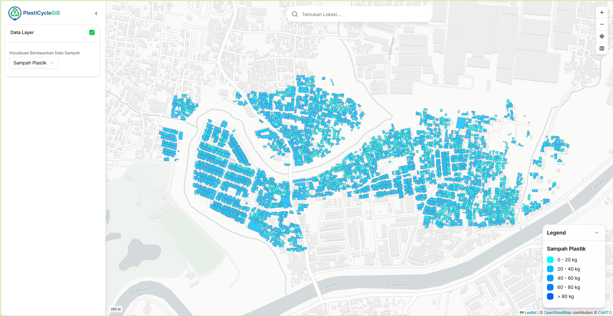
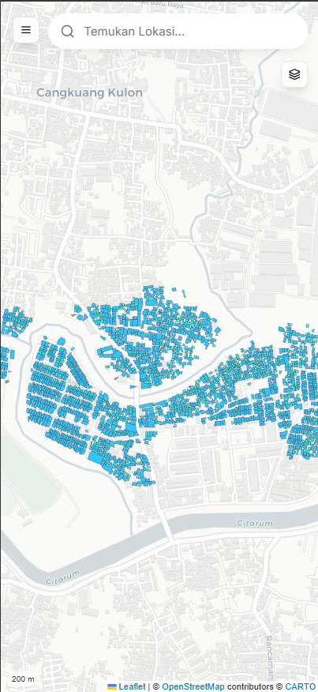

# GisSampah App - Aplikasi Pemetaan Sampah Responsif.

|                         Tampilan Desktop                          |                         Tampilan Mobile                         |
| :---------------------------------------------------------------: | :-------------------------------------------------------------: |
|  |  |

---

## ✨ Fitur Utama

- **Desain Responsif (Mobile-First)**: Antarmuka yang dioptimalkan sepenuhnya, memberikan pengalaman pengguna yang berbeda dan intuitif di perangkat desktop dan mobile.
- **Peta Interaktif**: Tampilan peta yang mulus dan cepat menggunakan Leaflet.js dan React-Leaflet.
- **Visualisasi Data Dinamis**: Data GeoJSON diwarnai secara dinamis berdasarkan atribut yang dipilih (Estimasi, Sampah Plastik, Organik, dll.).
- **Pencarian Lokasi Geografis**: Mencari nama tempat atau alamat di seluruh dunia menggunakan API Nominatim, dengan saran autocomplete dan debounce untuk performa optimal.
- **Manajemen State Terpusat**: Menggunakan Zustand untuk state management yang efisien dan mudah diakses di seluruh komponen.
- **Kontrol Layer & Legenda Dinamis**: Menampilkan/menyembunyikan layer data dan legenda peta yang otomatis beradaptasi dengan visualisasi aktif.
- **Toolbar Peta Adaptif**:
  - **Desktop**: Toolbar vertikal yang ringkas untuk Zoom, Kembali ke Posisi Awal, dan Pilihan Basemap.
  - **Mobile**: Tombol aksi utama yang membuka `Popover` berisi semua alat peta, menghemat ruang layar.
- **Sidebar Cerdas**:
  - **Desktop**: Sidebar statis yang dapat disembunyikan.
  - **Mobile**: Sidebar "drawer" yang muncul dari samping dengan backdrop gelap.
- **Panel Informasi Detail**: Menampilkan informasi rinci dari poligon yang diklik dalam kartu (card) yang mengambang di tengah layar.
- **Tema Peta & Styling Dinamis**:
  - Beralih dengan mulus antara tema peta Light, Dark, dan Satellite.
  - Border poligon secara otomatis berubah menjadi putih pada tema gelap untuk kontras maksimal.
- **Indikator Skala Kustom**: Menampilkan skala peta (misal, "50 m") dalam format teks minimalis, tanpa elemen grafis yang mengganggu.

---

## 🚀 Teknologi yang Digunakan

- **Framework**: [Next.js](https://nextjs.org/) (App Router)
- **Bahasa**: [TypeScript](https://www.typescriptlang.org/)
- **Peta**: [Leaflet.js](https://leafletjs.com/) & [React-Leaflet](https://react-leaflet.js.org/)
- **Styling**: [Tailwind CSS](https://tailwindcss.com/)
- **Komponen UI**: [shadcn/ui](https://ui.shadcn.com/)
- **State Management**: [Zustand](https://github.com/pmndrs/zustand)
- **Ikon**: [Lucide React](https://lucide.dev/)
- **Geocoding API**: [Nominatim (OpenStreetMap)](https://nominatim.org/)

---

## 📁 Struktur Folder Proyek

Proyek ini menggunakan struktur direktori root untuk kejelasan, memisahkan logika aplikasi, hooks, dan state management.

```
gissampah-app/
├── app/ # Direktori utama Next.js App Router (halaman dan layout)
├── components/
│ ├── controls/ # Kontrol peta (Toolbar, LayerControl, ScaleControl)
│ ├── layout/ # Komponen layout utama (Desktop/Mobile Wrappers, Header, Sidebar)
│ ├── map/ # Komponen inti peta (MapDisplay, GeoJsonLayer, ChangeView)
│ ├── panel/ # Komponen panel informasi (BuildingInfo, LegendDisplay)
│ └── ui/ # Komponen dari shadcn/ui
├── hooks/ # Hooks kustom React (useDebounce, useBreakpoint)
├── lib/ # Fungsi utilitas (mapUtils.ts, utils.ts)
├── public/
│ ├── data/ # Tempat penyimpanan file GeoJSON
│ └── images/ # Gambar thumbnail untuk basemap
├── store/ # State management global (Zustand: mapStore.ts)
├── styles/ # File CSS kustom (misal: untuk override style Leaflet)
├── types/ # Definisi tipe TypeScript global (index.ts)
└── ... # File konfigurasi (next.js, tailwind, postcss, dll.)
```

---

## 🏁 Memulai Proyek

### Prasyarat

- [Node.js](https://nodejs.org/) (versi LTS direkomendasikan)
- [npm](https://www.npmjs.com/) atau [yarn](https://yarnpkg.com/) atau [pnpm](https://pnpm.io/)

### Instalasi

1.  Clone repositori ini:
    ```bash
    git clone [URL_REPOSITORI]
    ```
2.  Masuk ke direktori proyek:
    ```bash
    cd gissampah-app
    ```
3.  Instal semua dependensi:
    ```bash
    npm install
    # atau
    yarn install
    ```

### Menjalankan Server Pengembangan

Setelah instalasi selesai, jalankan server pengembangan:

```bash
npm run dev
# atau
yarn dev
```

Buka [http://localhost:3000](http://localhost:3000) di browser Anda untuk melihat hasilnya.

---
